# Gordon Ramsay Restaurant Reservation System (GRRRS)


**Qdreon | CPE 2201 Software Design and Development**

GRRRS is a web-based, single-tenant restaurant reservation system designed to replace manual reservation logbooks with a real-time customer booking portal and restaurant admin dashboard.

The system supports customer reservation booking, simulated deposit checkout, virtual waitlist handling, admin table management, guest CRM, menu management, system health monitoring, and QA-backed verification reports.

---

## Demo Access

| Item                    | Link / Location                                                         |
| ----------------------- | ----------------------------------------------------------------------- |
| Google Drive Demo Video | `https://drive.google.com/drive/folders/1yTfuV7mE2hxFuxoOyQJBCsvCg38k4bzc?usp=sharing`                                    |
| GitHub Repository       | `https://github.com/Qdreon/Gordon-Ramsay-Restaurant-Reservation-System` |
| Online Link           | `https://gordon-ramsay-restaurant-reservatio.vercel.app/`                                                            |
| Local Demo URL          | `http://localhost:3000`                                                 |
| Playwright Report       | `playwright-report/index.html`                                          |
| Lighthouse Summary      | `tests/lighthouse/reports/summary.json`                                 |
| Documentation           | `Documents/`                                                            |

---

## Final Activity Timeline

| Section | Timeline | Status | Notes |
|---|---:|---|---|
| Section 1. Planning & Analysis | Feb 2 – May 5, 2026 | Done | Stakeholder requirements, MVP negotiation, SRS, progress report, and SPM-PC |
| Section 2. System Design | Mar 4 – Apr 22, 2026 | Done | COMET architecture, UML diagrams, PostgreSQL schema, UI/UX mockups, and SWDD |
| Section 3. Development | Apr 22 – May 12, 2026 | Done | Coding work completed before the official May 12 coding freeze |
| Section 4. Testing & QA | May 1 – May 12, 2026 | Done | Functional, structural, latency, concurrency, offline, RBAC, and compliance testing |
| Section 5. Submission / Handoff | May 13 – May 14, 2026 | Done | Documentation, evidence sync, Canvas submission, GitHub links, handoff notes |
| Section 6. Presentation & System Demo Prep | May 15 – May 19, 2026 | Done | 20-minute project presentation and 20-minute system demo preparation |
| Final Examination | May 20 – May 21, 2026 | Done | Final examination milestone only |

---

## System Scope

```mermaid
flowchart TB
    GRRRS["GRRRS<br/>Single-Tenant Restaurant Reservation System"]

    GRRRS --> CustomerPortal["Customer Portal"]
    GRRRS --> AdminSystem["Restaurant Management System<br/>(Admin Dashboard)"]
    GRRRS --> Backend["Supabase Backend"]
    GRRRS --> External["External Services"]

    CustomerPortal --> C1["Account Registration / Login"]
    CustomerPortal --> C2["Real-Time Availability Search"]
    CustomerPortal --> C3["View-Only Digital Menu"]
    CustomerPortal --> C4["Book Table + Simulated Deposit"]
    CustomerPortal --> C5["Join Virtual Waitlist"]
    CustomerPortal --> C6["Cancel Reservation"]
    CustomerPortal --> C7["Manage Profile / Delete Account"]

    AdminSystem --> A1["Static Interactive Floor Plan"]
    AdminSystem --> A2["Reservation Calendar / List"]
    AdminSystem --> A3["Walk-In / Phone Reservation Entry"]
    AdminSystem --> A4["Guest CRM"]
    AdminSystem --> A5["Menu Management"]
    AdminSystem --> A6["Manual Waitlist Control"]
    AdminSystem --> A7["System Health Monitoring"]

    Backend --> B1["Supabase Auth"]
    Backend --> B2["PostgreSQL Database"]
    Backend --> B3["Row-Level Security / RBAC"]
    Backend --> B4["Row-Locking / RPCs"]
    Backend --> B5["Realtime Subscriptions"]
    Backend --> B6["Triggers / Scheduled Jobs"]

    External --> E1["Mailtrap / SMTP Email"]
    External --> E2["Simulated Payment Gateway"]
```

---

## SWDD Architecture: Three-Tier Client-BaaS Design

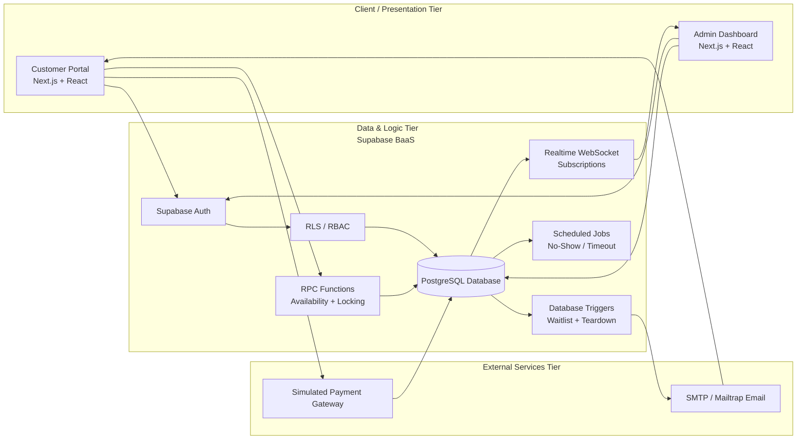

---

## Main Use Cases

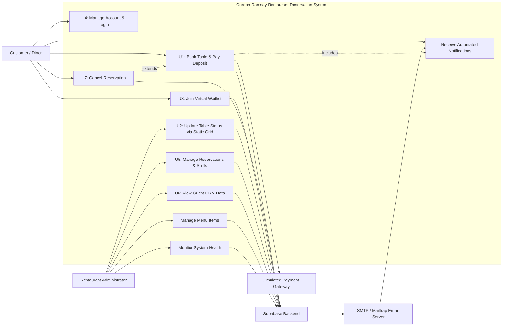

---

## Booking Engine Flow

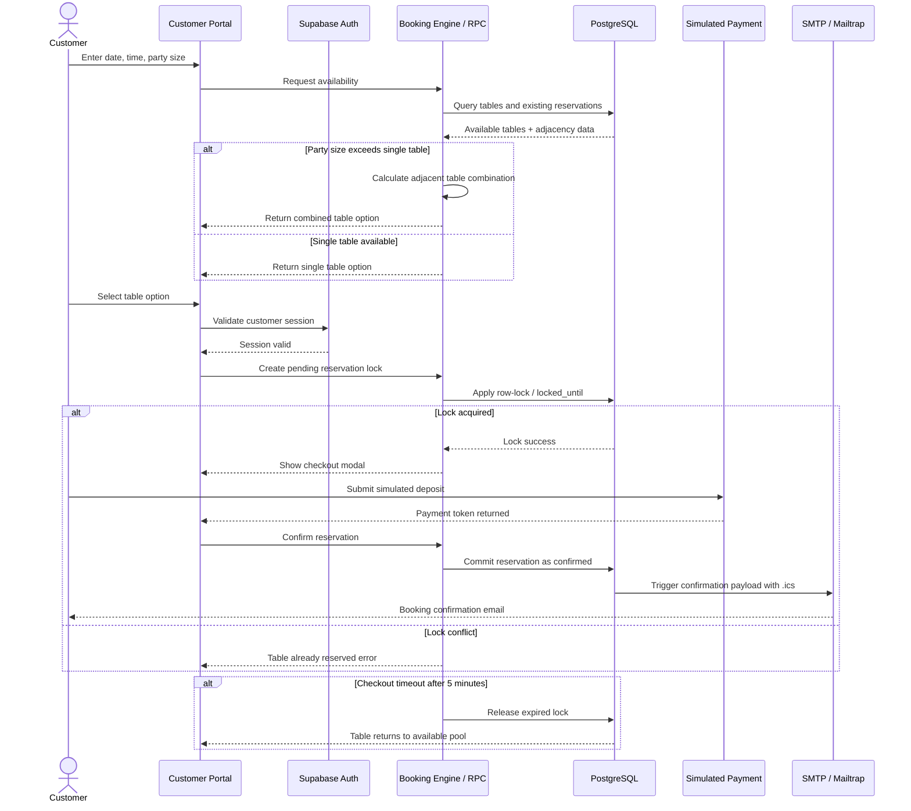

---

## Waitlist and Cancellation Automation

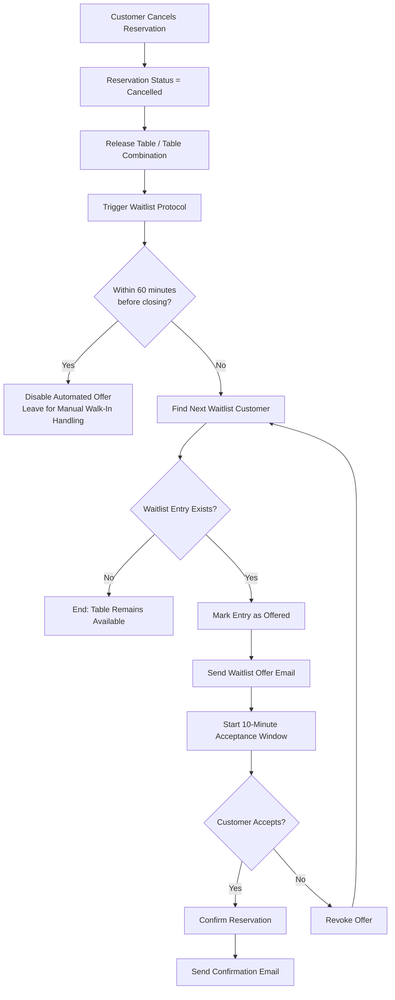

---

## Admin Floor Plan State Flow

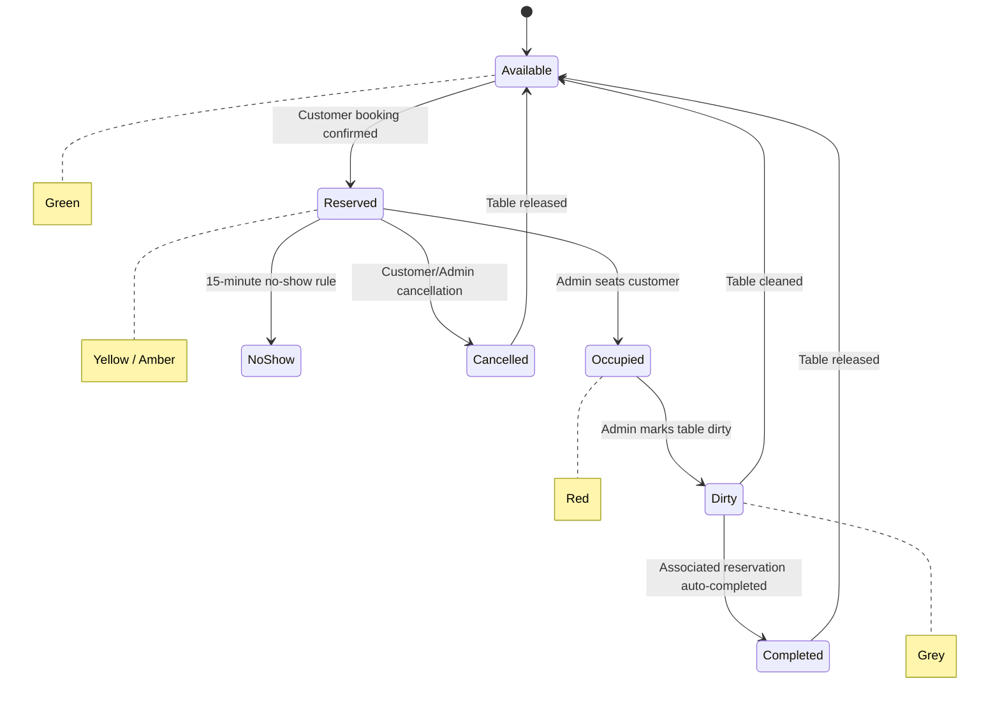

---

## Data Design Overview

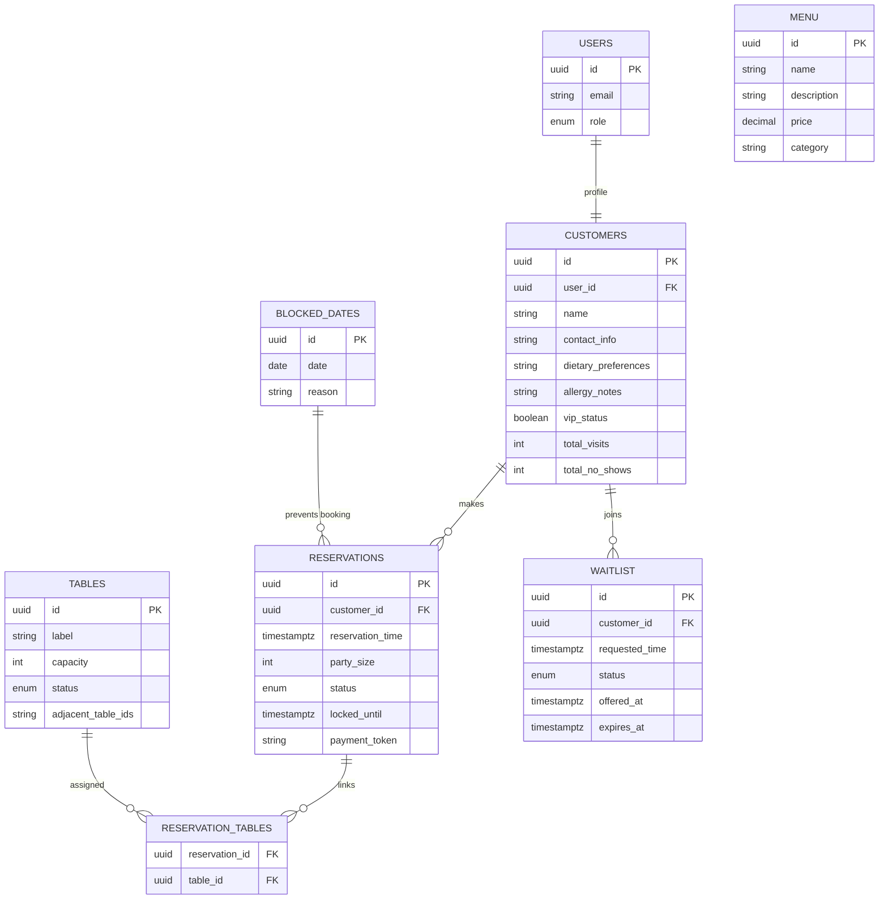

---

## SPM Risk-to-Control Mapping

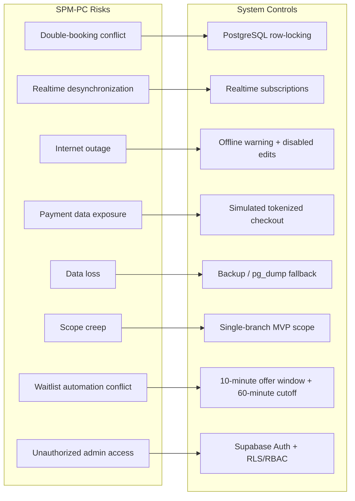

---

## SRS / SWDD / SPM Traceability

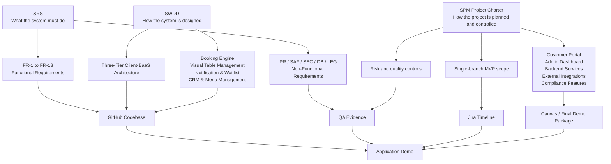

---

## Demonstrated Endpoints

| Area | Endpoint | Purpose |
|---|---|---|
| Customer Home | `/` | Availability search and menu preview |
| Login | `/auth/login` | Customer/admin authentication |
| Register | `/auth/register` | Account creation and consent validation |
| Customer Dashboard | `/customer/dashboard` | Reservation output and account management |
| Admin Dashboard | `/admin/dashboard` | Admin overview and system health |
| Admin Floor Plan | `/admin/floorplan` | Real-time table status grid |
| Admin Reservations | `/admin/reservations` | Calendar, blocked dates, operating-hours validation |
| Admin CRM | `/admin/crm` | Guest history, allergies, VIP, no-shows |
| Admin Menu | `/admin/menu` | Menu CRUD |
| Admin Waitlist | `/admin/waitlist` | Queue management and prioritization |
| Health API | `/api/health` | Database, email, and payment checks |
| Reservation Lock API | `/api/reservations/lock` | Booking lock and conflict handling |
| Waitlist Capacity API | `/api/waitlist/capacity` | Waitlist limit check |
| Waitlist Join API | `/api/waitlist/join` | Waitlist entry creation |
| Notification API | `/api/notifications/send` | Booking and waitlist email payloads |

---

## Demo Coverage

| Demo Requirement | Shown Through |
|---|---|
| Application is accessible and functional | Local or deployed app opens and modules are navigable |
| Login / Authentication | Customer and admin login, protected admin routes |
| Major system features | Booking, waitlist, floor plan, CRM, menu, reservation calendar, system health |
| Input and output processes | Search inputs produce availability, reservation, waitlist, or validation outputs |
| Reports or analytics | Lighthouse, Playwright, concurrency, RBAC, system health, traceability matrix |
| Error handling and validations | Consent, operating hours, no availability, protected routes, tokenized payment, offline warning |

---

## Reports and Analytics

Instead of a business analytics dashboard, the MVP uses **System Verification Reports and Performance Analytics**.

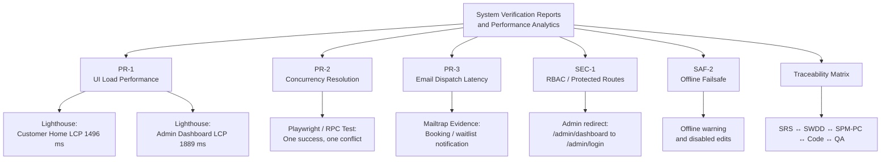

### Lighthouse Performance Results

| Page | Endpoint | Score | LCP | FCP | TBT | CLS | TTI | Speed Index | Result |
|---|---|---:|---:|---:|---:|---:|---:|---:|---|
| Customer Home | `/` | 79 | 1496 ms | 1046 ms | 963 ms | 0.001 | 7538 ms | 2202 ms | PASS |
| Admin Dashboard | `/admin/dashboard` | 79 | 1889 ms | 1191 ms | 895 ms | 0.000 | 7789 ms | 1543 ms | PASS |

### Endpoint Protection Observation

| Requested URL | Final URL | Meaning |
|---|---|---|
| `/admin/dashboard` | `/admin/login?next=%2Fadmin%2Fdashboard` | Unauthenticated admin access is redirected to login |

### Re-run Needed

| Page | Endpoint | Result | Reason |
|---|---|---|---|
| Login Page | `/auth/login` | Re-run needed | Lighthouse returned `CHROME_INTERSTITIAL_ERROR` during one audit run |

---

## Validation and Error Handling

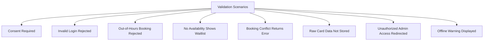

| Validation | Result |
|---|---|
| Consent checkbox | Registration blocked until consent is checked |
| Invalid login | User remains unauthenticated |
| Out-of-hours reservation | Error message displayed |
| No availability | Waitlist option displayed |
| Booking conflict | One reservation succeeds, conflicting request fails |
| Payment data | Tokenized simulated payment only |
| Admin route protection | Non-authenticated users redirected to login |
| Offline state | Admin floor plan shows warning |

---

## Development and QA Timeline

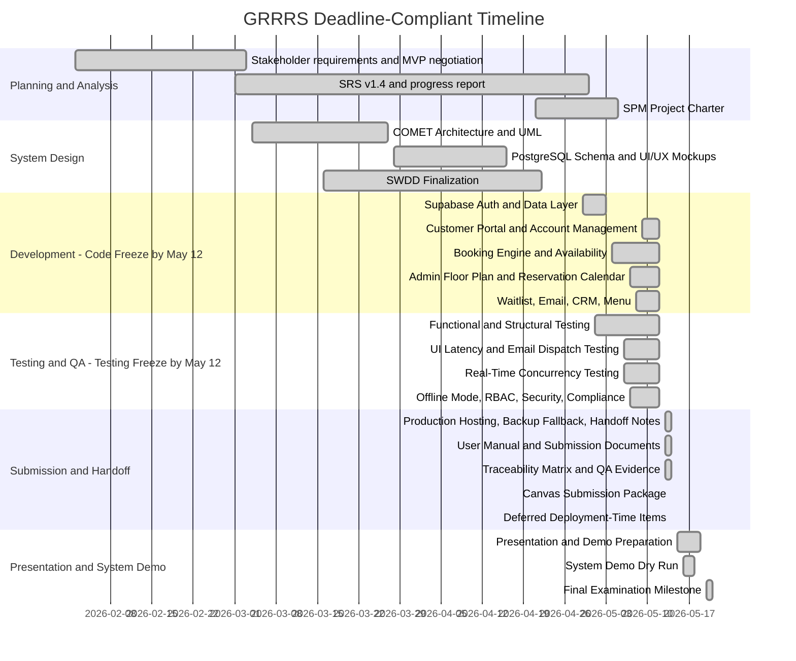

---

## Jira-Aligned Phase Summary

| Jira Section | Timeline | Status |
|---|---:|---|
| QDR-23 Section 1. Planning & Analysis | Feb 2 – May 5 | Done |
| QDR-29 Section 2. System Design | Mar 4 – Apr 22 | Done |
| QDR-35 Section 3. Development — Code Freeze by May 12 | Apr 22 – May 12 | Done |
| QDR-46 Section 4. Testing and QA — Testing Freeze by May 12 | May 1 – May 12 | Done |
| QDR-51 Section 5. Submission, Deployment Evidence, and Handoff | May 13 – May 14 | Done |
| Section 6. Presentation and System Demo Preparation | May 15 – May 19 | Done |
| Final Examination Readiness Milestone | May 20 – May 21 | Done |

---

## Playwright Live Demo

Recommended command:

```bash
npx playwright test tests/e2e/grrrs-live-demo.spec.ts --headed --project=chromium --workers=1
```

For screen recording with slower actions:

```bash
npx playwright test tests/e2e/grrrs-live-demo.spec.ts --headed --project=chromium --workers=1 --slow-mo=500
```

Open the report:

```bash
npx playwright show-report
```

---

## Demo Video Structure

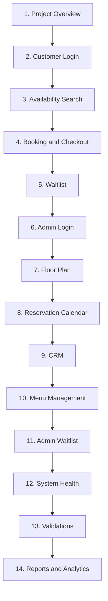

---

## Final Demo Claim

GRRRS demonstrates a complete requirements-driven MVP: customer booking, admin operations, real-time table management, waitlist automation, security controls, validation handling, and QA-backed performance evidence.
